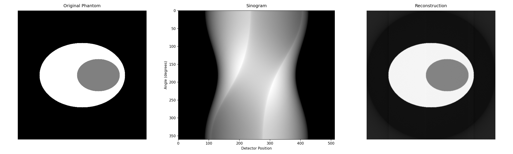

# TomoMetal

TomoMetal is a high-performance tomographic reconstruction library that leverages Apple's Metal Performance Shaders (MPS) through PyTorch. Built specifically for Apple Silicon, it provides GPU-accelerated Filtered Back Projection (FBP) with performance comparable to established toolboxes like ASTRA or TIGRE, while being optimized for modern Mac systems.


*Left: Original Shepp-Logan phantom. Middle: Sinogram of 180 projections. Right: GPU-accelerated reconstruction.*

## Features

- Fast GPU-accelerated reconstruction using Apple's Metal framework via PyTorch
- Support for TIFF projection loading with metadata
- Efficient Fourier-domain filtering
- Optimized backprojection using PyTorch's grid sampling
- Modular design for easy extension and modification

## Requirements

- macOS with Apple Silicon (M1/M2/M3) processor
- Python 3.8+
- PyTorch 2.1.0+ (with MPS backend)
- Other dependencies listed in requirements.txt

## Installation

This project uses [pixi](https://prefix.dev/docs/pixi/overview) for dependency management. First, install pixi following the instructions [here](https://prefix.dev/docs/pixi/installation).

Then:

1. Clone this repository
2. Install dependencies:
   ```bash
   pixi install
   ```
3. Run the example:
   ```bash
   pixi run python examples/example.py
   ```

## Usage

Basic usage example:

```python
from reconstruction import TomographicReconstructor
import torch

# Initialize reconstructor (automatically uses MPS if available)
reconstructor = TomographicReconstructor()

# Load your TIFF projections
sinogram = reconstructor.load_projections(['projection1.tiff', 'projection2.tiff', ...])

# Create or load your angles (in degrees)
angles = torch.linspace(0, 180, num_projections)

# Perform reconstruction
reconstruction = reconstructor.reconstruct(sinogram, angles)
```

See `src/example.py` for a complete usage example.

## Implementation Details

The reconstruction pipeline consists of three main steps:

1. **Data Loading**: Efficient loading of TIFF projections into PyTorch tensors
2. **Filtering**: Ramp filtering in Fourier domain using PyTorch's FFT capabilities
3. **Backprojection**: GPU-accelerated backprojection using PyTorch's grid_sample

All operations are performed on the GPU using PyTorch's MPS backend, providing significant speedup compared to CPU implementations.

## Performance

The implementation leverages PyTorch's MPS backend to utilize Apple's Metal framework for GPU acceleration. Key performance optimizations include:

- Batch processing of projections
- Efficient memory management
- Vectorized operations
- Hardware-accelerated interpolation

## License

MIT License
