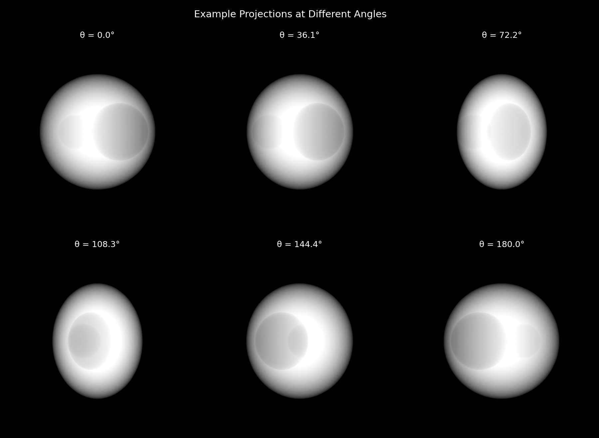
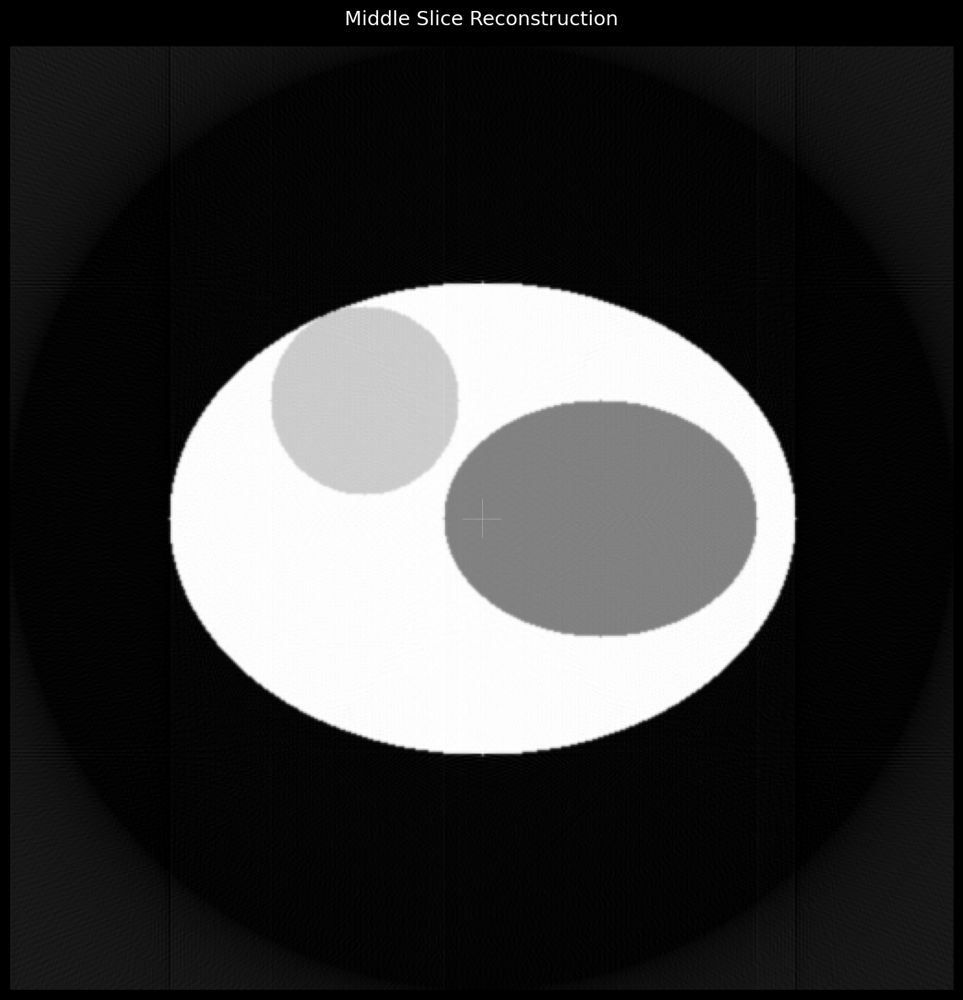

# TomoMetal

TomoMetal is a high-performance tomographic reconstruction library that leverages Apple's Metal Performance Shaders (MPS) through PyTorch.

## Features

- Fast GPU-accelerated reconstruction using Apple's Metal framework via PyTorch
- Support for TIFF projection loading with metadata
- Efficient Fourier-domain filtering
- Optimised backprojection using PyTorch's grid sampling
- Modular design for easy extension and modification
- Comprehensive test suite with configurable resolution and projection angles

## Example Results

### 3D Phantom Projections

*Example projections from our 3D phantom dataset.*

### High Resolution Reconstruction

*512³ reconstruction of the middle slice using 360 projection angles.*

## Requirements

- macOS with Apple Silicon processor
- Python 3.8+
- PyTorch 2.1.0+ (with MPS backend)

## Installation

This project uses [pixi](https://prefix.dev/docs/pixi/overview) for dependency management. First, install pixi following the instructions [here](https://prefix.dev/docs/pixi/installation).

Then:

1. Clone this repository
2. Install dependencies:
   ```bash
   pixi install
   ```
3. Run the example:
   ```bash
   pixi run python examples/example.py --input_dir path/to/your/tiffs --num_angles 180 --output_file custom_reconstruction.png --use_hamming
   ```
   The `examples/example.py` script accepts the following command-line arguments:
    *   `--input_dir`: (Required) Path to the directory containing your TIFF projection images (e.g., `path/to/your/tiffs`).
    *   `--output_file`: (Optional) Path and filename for the saved reconstruction image. Default: `reconstruction.png`.
    *   `--num_angles`: (Optional) Number of projection angles to generate using `torch.linspace(0, 180, num_angles)`. Default: 180.
    *   `--use_hamming`: (Optional) If specified, enables the Hamming window during ramp filtering. Defaults to False (no Hamming window) if not present.

## Usage

Basic usage example:

```python
from reconstruction import TomographicReconstructor
import torch

# Initialise reconstructor (automatically uses MPS if available)
reconstructor = TomographicReconstructor()

# Load your TIFF projections
sinogram = reconstructor.load_projections(['projection1.tiff', 'projection2.tiff', ...])
```

### Running Tests

The test suite includes both 2D and 3D reconstruction tests with configurable parameters:

```bash
# Default settings (256³, 180 angles)
pixi run test-3d
pixi run generate-3d-data

# Fast mode for quick testing (128³, 90 angles)
pixi run test-3d-fast
pixi run generate-3d-data-fast

# High quality mode (512³, 360 angles)
pixi run test-3d-hq
pixi run generate-3d-data-hq

# Custom parameters
python tests/generate_3d_dataset.py --size=200 --angles=120
python tests/test_3d_reconstruction.py --size=200 --angles=120
```

# Create or load your angles (in degrees)
```
angles = torch.linspace(0, 180, num_projections)
```

# Perform reconstruction
```
reconstruction = reconstructor.reconstruct(sinogram, angles)
```

See `examples/example.py` for a complete usage example (the script discussed in step 3 of Installation).

## Implementation Details

The reconstruction pipeline consists of three main steps:

1. **Data Loading**: Efficient loading of TIFF projections into PyTorch tensors
2. **Filtering**: Ramp filtering in Fourier domain using PyTorch's FFT capabilities
3. **Backprojection**: GPU-accelerated backprojection using PyTorch's grid_sample

All operations are performed on the GPU using PyTorch's MPS backend, providing significant speedup compared to CPU implementations.

## Performance

The implementation leverages PyTorch's MPS backend to utilise Apple's Metal framework for GPU acceleration. Key performance optimisations include:

- Batch processing of projections
- Efficient memory management
- Vectorised operations
- Hardware-accelerated interpolation
## License

MIT License
